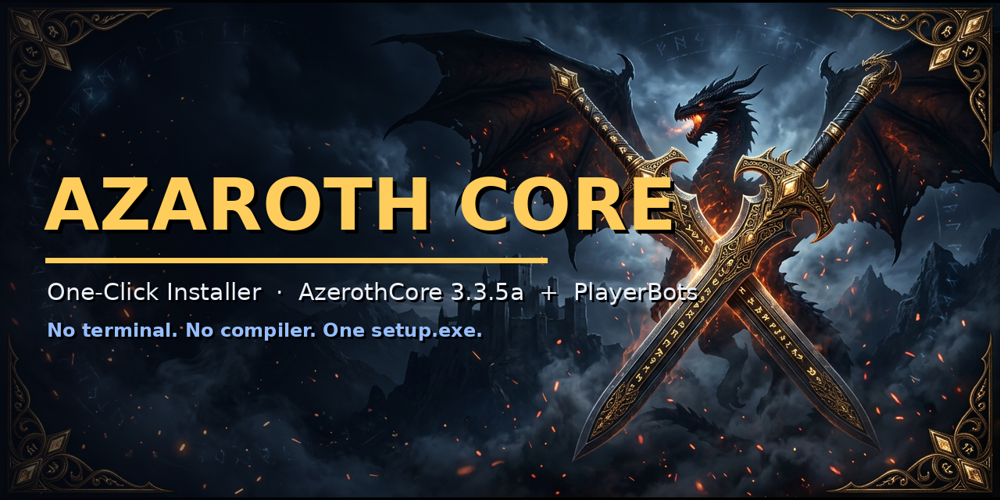

<p align="center">
  
</p>

<h1 align="center">Azaroth Core — One-Click Installer</h1>

<p align="center">
  <strong>The complete private WotLK 3.3.5a world with PlayerBots — installed from a single <code>setup.exe</code>.</strong><br>
  <strong>No terminal &nbsp;·&nbsp; No compiler &nbsp;·&nbsp; No developer skills</strong>
</p>

<p align="center">
  <a href="https://github.com/DLinacre/azaroth-installer/releases/latest">
    
  </a>
  <a href="https://github.com/DLinacre/azaroth-installer/releases/latest">
    
  </a>
  <a href="https://github.com/DLinacre/azaroth-installer/blob/main/LICENSE">
    
  </a>
  <a href="https://github.com/DLinacre/azaroth-installer/blob/main/SECURITY.md">
    
  </a>
  
</p>

<p align="center">
  <a href="docs/CONFIG.md"><b>Configuration</b></a> •
  <a href="docs/TROUBLESHOOTING.md"><b>Troubleshooting</b></a> •
  <a href="#frequently-asked-questions"><b>FAQ</b></a> •
  <a href="CONTRIBUTING.md"><b>Contributing</b></a> •
  <a href="CHANGELOG.md"><b>Changelog</b></a> •
  <a href="LICENSE"><b>MIT License</b></a>
</p>

---

## What is this?

**Azaroth Core** is a private [AzerothCore](https://github.com/azerothcore/azerothcore-wotlk)
**3.3.5a (Wrath of the Lich King)** world with the
[**PlayerBots**](https://github.com/mod-playerbots/mod-playerbots) module
(randombots, AddClass pool, altbots) — packaged so that a *regular person* can run it
on their own PC:

1. Download **`setup.exe`** from the [Releases](https://github.com/DLinacre/azaroth-installer/releases) page.
2. Double-click it. Approve the Windows UAC elevation prompt.
3. Click **⚡ Full Auto Install** and go get a coffee.

When it finishes you have **Start Azaroth Server** / **Play Azaroth** desktop shortcuts,
a ready **GM account** with a **cryptographically randomized password generated during installation** (shown once on the Done screen and saved in the install folder), a local-subnet firewall rule, and a server stack that is **boot-verified before the wizard completes**.

> ⚠️ **Personal/private use.** Running a private World of Warcraft server and using bots
> can violate Blizzard's Terms of Use. The server emulator is open source and this
> installer never redistributes Blizzard game files — it reuses the 3.3.5 client you
> already have. See [Legal](#legal).

## How the wizard works

| Step | What happens automatically |
|------|----------------------------|
| 1 · **System Check** | Probes **CPU** (model/cores), **RAM**, **GPU** (+VRAM), Windows version and **every drive**; warns if the PC is too weak. |
| 2 · **Install Location** | **Auto-picks the drive with the most free space** (≥ 30 GB, configurable). You can override. |
| 3 · **Server Core** | Takes your **prebuilt Windows AzerothCore + PlayerBots zip** (local file or direct URL), extracts it and **auto-detects the layout**: worldserver/authserver/realmserver, configs, bundled MySQL, bundled data, SQL dumps, nested zips. |
| 4 · **Data & PlayerBots** | Game data (`dbc/maps/vmaps/mmaps`) is **downloaded only if the repack doesn't already include it** (default: AC Data v20). Fetches `playerbots.conf` if missing. |
| 5 · **Database** | Efficiency order: ① **MySQL bundled with the repack** (prebuilt DB reused as-is) → ② **existing MySQL/MariaDB on the PC** (reused, nothing installed) → ③ fresh silent MySQL 8 install. Existing `azaroth_*` DBs are **never re-imported** — your characters survive re-runs. |
| 6 · **Game Client** | Scans registry + every drive for an existing **WoW 3.3.5 client** (flags modern `_retail_` clients). Nothing is moved or modified. |
| 7 · **World & Options** | Make the realm yours: **realm name**, client **locale**, **XP / Honor / Gold rates**, **level cap**, PlayerBots population (random bots, auto-login, AddClass pool, bot guilds), a **module picker** (auto-detects every module DLL in the repack — check = enabled, uncheck = moved to `modules_disabled\`), **extra modules by URL**, the **GM Genie** GM-tools add-on, and your GM credentials. Also shows the instant-raid bot commands. |
| 8 · **Verify & Finish** | Writes all server configs (dual config-style support for old *and* new AzerothCore, adds **`Mod_PlayerBots`** where applicable), applies your world options, creates the GM account + character, patches `realmlist.wtf`, adds the firewall rule, creates shortcuts, then **boots the whole stack and verifies it runs** before handing over. |
| 9 · **Done** | **Start Server** / **Play** / **Open Folder** buttons. |

**⚡ Full Auto Install** (default button) runs all steps with the best options for the
detected hardware — zero further clicks. Manual step-by-step mode is also available.
Everything is logged live in the wizard; re-running it detects an existing install and
repairs instead of clobbering.

## Requirements

| | Minimum | Recommended |
|---|---------|-------------|
| OS | Windows 10 64-bit | Windows 11 64-bit |
| CPU | 4 cores | 6+ cores |
| RAM | 4 GB | 8–16 GB |
| Disk | 30 GB free (server + data) | 50 GB free |
| GPU | Any (local play) | 2 GB+ VRAM (for the client) |
| Network | ~1.5–2 GB on first run (only what the repack lacks) | — |

Plus: your **own World of Warcraft 3.3.5a client** (build 12340). The wizard finds an
existing install — it never downloads or modifies client files.

## Quick start (end user)

1. Get `setup.exe` from **Releases** → `azaroth-core-installer-vX.Y.Z.zip` → extract → double-click `setup.exe`.
2. Windows SmartScreen may warn (the build is unsigned — that's normal for community tools): **More info → Run anyway**.
3. On the Welcome screen: **⚡ Full Auto Install**.
4. At the **Server Core** step, if your Azaroth zip isn't auto-downloaded, click **Browse for .zip** and pick it.
5. Done screen → **▶ Start Azaroth Server** → wait for `world server is running` → **🎮 Play** → log in as **`gm` / `gm1234`**.

### Instant raids & PlayerBots cheat sheet (verified from the official wiki)

| In-game command | What it does |
|---------|--------------|
| `lfg` (in your raid) | A bot **joins your raid instantly**, filling an open tank/healer/DPS slot |
| `lfg 25` | Same, targeting a 25-man raid |
| `.playerbots bot addclass warrior` | Summons a geared bot of any class (`dk` for death knight) |
| `.playerbots bot add [name1,name2]` | Logs your alt characters in as bots |
| `.playerbots bot add *` | Logs in all alts in your party/raid as bots |
| whisper `summon` / `follow` / `attack` / `grind` | Direct a bot (or use `/p` and `/r` for party/raid-wide) |
| `.playerbots` | Full command list in game |

Full docs: [mod-playerbots wiki](https://github.com/mod-playerbots/mod-playerbots/wiki).

### Extra modules

The wizard auto-detects every module DLL shipped by your repack (OwnedCore bundles
30+, e.g. transmog, AHBot, guild houses…) and lets you toggle each one. It can also
install **extra prebuilt modules from a direct link** (`.dll` or `.zip`), and it adds
the open-source [**GM Genie**](https://github.com/azerothcore/GMGenie) GM-tools
add-on straight into your client.

> C++ modules must be **prebuilt DLLs matching your repack's core version** — the
> wizard installs files, it never compiles. The upstream project list lives in the
> [azerothcore GitHub org](https://github.com/azerothcore) (mod-transmog,
> mod-ah-bot, mod-guildhouse, mod-individual-xp, mod-npc-*, …) — grab prebuilt
> builds from your repack author or a source you trust.

## Use your own “Azaroth Core” build

The wizard is **repack-agnostic** — it accepts *any* prebuilt **Windows** AzerothCore
zip (yours, OwnedCore, DrePack, …) and figures the layout out itself. To make a default:

1. Host your release zip behind a **direct HTTPS link** (Mega links need special API
   handling — use a direct file link, or just pick the local zip in the wizard).
2. Edit **`config.json`** next to `setup.exe` (Notepad) → `downloads.serverRepack.urls`.
3. Run `setup.exe` again.

The same file configures the game-data source, the database MSI, `playerbots.conf`,
server name, ports, GM credentials and more — full reference in
[docs/CONFIG.md](docs/CONFIG.md).

## Building from source

Wizard = C# / WinForms, .NET 8. On a Windows PC with the [.NET 8 SDK](https://dotnet.microsoft.com/download/dotnet/8.0):

```powershell
.\build.ps1          # → dist\setup.exe + dist\config.json
```

or manually:

```powershell
dotnet publish src -c Release -r win-x64 --self-contained true `
  -p:PublishSingleFile=true -p:IncludeNativeLibrariesForSelfExtract=true -o dist
```

Linux/macOS cross-building works the same way (`-r win-x64`); the CI workflow
(`.github/workflows/build.yml`) does exactly this on every push and uploads the
installer as an artifact. **Release binaries live in GitHub Releases, not in git**
(the 145 MB exe is too big for the repo).

## Repository structure

```
├── assets/                  banner + app icon sources
├── docs/
│   ├── CONFIG.md            full config.json reference
│   └── TROUBLESHOOTING.md   common problems & fixes
├── src/                     the installer (C# / WinForms)
│   ├── WizardForm.cs        9-step wizard UI (full-auto + manual)
│   ├── ServerBuilder.cs     repack layout detection, DB resolution, configs, smoke test
│   ├── SysProbe.cs          CPU/GPU/RAM/drive probes + WoW client scan
│   ├── Downloader.cs        retrying downloader with live progress
│   ├── ZipEx.cs             safe streaming zip extraction (zip-slip protection)
│   ├── SqlUtil.cs           MySQL/MariaDB client wrapper
│   ├── AppConfig.cs         config.json model
│   └── ...
├── .github/                 CI workflow + issue/PR templates
├── build.ps1
└── LICENSE                  MIT
```

Built binaries (`setup.exe`, `config.json`) are produced in `dist/` (gitignored) and
attached to [Releases](https://github.com/DLinacre/azaroth-installer/releases).

## Credits

- [**AzerothCore**](https://github.com/azerothcore/azerothcore-wotlk) — the 3.3.5a server emulator (AGPL-3.0)
- [**mod-playerbots**](https://github.com/mod-playerbots/mod-playerbots) — the PlayerBots module
- [**wowgaming/client-data**](https://github.com/wowgaming/client-data) — AC game data releases
- [**MySQL**](https://www.mysql.com) / [**MariaDB**](https://mariadb.org) — database engines
- The WoW private-server community (OwnedCore, DrePack, ACBS and other repacks that this layout-detection logic was shaped against)

## Frequently asked questions

**Is this legal?** The installer is open source (MIT) and never redistributes Blizzard game files — it reuses the 3.3.5a client you already own. Running a private WoW server can violate Blizzard's EULA/ToU; use it privately and non-commercially at your own risk. See [Legal](#legal).

**Why does SmartScreen warn me?** The build isn't Authenticode code-signed yet (common for community open source tools). Click **More info → Run anyway**, and verify the [SHA-256 checksum](https://github.com/DLinacre/azaroth-installer/releases/latest) on the release page.

**Can I play with friends?** Yes — enable **LAN play** in the wizard; it binds to your LAN IP and adds a local-subnet scoped firewall rule.

**What if I have no repack zip?** The wizard is repack-agnostic and accepts any prebuilt Windows AzerothCore 3.3.5a zip. Put a direct HTTPS link in `config.json → downloads.serverRepack.urls` or pick a local `.zip` at the Server Core step.

**Will reinstalling wipe my characters?** No. The installer detects an existing install and reuses the `azaroth_*` databases; characters survive re-runs. Use "re-import database files" only if you deliberately want a clean reset.

## Legal

- This project is **for private, non-commercial use at your own risk**. Running a
  private WoW server and using bots can violate Blizzard's Terms of Use/EULA.
- The installer itself does **not** contain or redistribute Blizzard-protected game
  client files; it detects and reuses the 3.3.5a client already on the user's machine.
- AzerothCore is AGPL-3.0/GPL-2.0; mod-playerbots is open source. Downloading a server
  repack means accepting whatever license the repack author published — only use
  repacks from sources you trust.
- “World of Warcraft” and related marks belong to Blizzard Entertainment, Inc.

## License

[MIT](LICENSE) — do whatever you want, no warranty, keep the license header.

